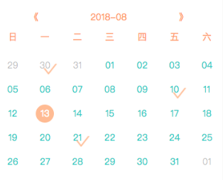
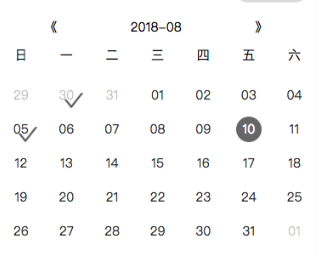
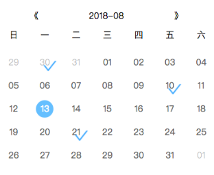
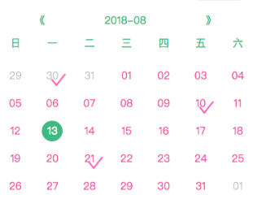
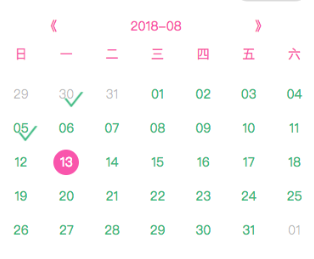

# wepy-com-calendar
[](https://www.npmjs.com/package/wepy-com-calendar)

>
>> 功能齐全的wepy日历组件，欢迎fork

## 介绍

-  内置多种主题，亦可自定义主题样式
-  响应式宽高
-  支持打卡功能
-  支持国际化（目前支持中、英两种）
-  年、月通过小程序的picker进行改变，亦可通过上月、下月按钮进行改变

## HOW TO USE

### install
```
npm install wepy-com-calendar --save
```

### use
```javascript
// 在script标签内
import Calendar from 'wepy-com-calendar';
class MyCompent extens wepy.component {
  data = {
    selectedDates: ['2018-07-30', '2018-08-10', '2018-08-21']
  }
  events = {
    calendarAfterTapDay(date, e) {
      // 点击某一天后的回调
    }
  }
}

// 在template标签内
<template>
  <Calendar :checks.sync="selectedDates" theme="orange" />
</template>
```



### 其他主题展示

| 主题名称 | 展示 |
|:----------|:-------------|
| default|black |  |
| orange |  |
| blue |  |
| pink |  |
| green |  |

## API

| 参数 | 说明 | 类型 | 默认值 |
|:----------|:-------------|:------|:------:|
| date | 高亮的日期 | YYYY-MM-DD | 当前日期 |
| checks | 打卡的日期 | array | [] |
| theme | 主题名称，可选值有 `default`, `green`, `pink`, `orange`, `black`, `blue` | string | `default` |
| themeClassName | 主题类名，用于自定义主题样式，优先级比`theme`高，传入此参数后，`theme`参数失效 | string | - |
| language | 语言，支持中(`zh_CN`)、英(`en_GB`)两种 | string | `zh_CN` |
| icon | `check`状态时`image`的`src`地址，如果不传此参数，则使用`theme`内置的图片作为icon | string | - |
| activeStyle | 高亮的日期的样式 | string | - |

## 事件EVENTS

`wepy-com-calendar`组件内统一通过`$emit`方式跟父组件通信，所以使用`wepy-com-calendar`组件时，将事件方法统一放在父组件的events属性上

| 参数   |      说明      | 类型 |
|:----------|:-------------|:------:|
| calendarAfterTapDay | 点击某一天后触发的事件 | <code>	function(date: YYYYMMDD, event) </code> |
| calendarAfterTapNextMonth | 点击下个月按钮触发的事件 | <code>	function(event) </code> | [] |
| calendarAfterTapPreMonth | 点击上个月按钮触发的事件 | <code>	function(event) </code> | [] |
| calendarAfterChangePicker | 通过年月选择器修改年或月后触发的事件 | <code>	function(date: YYYYDD,event) </code> | [] |
